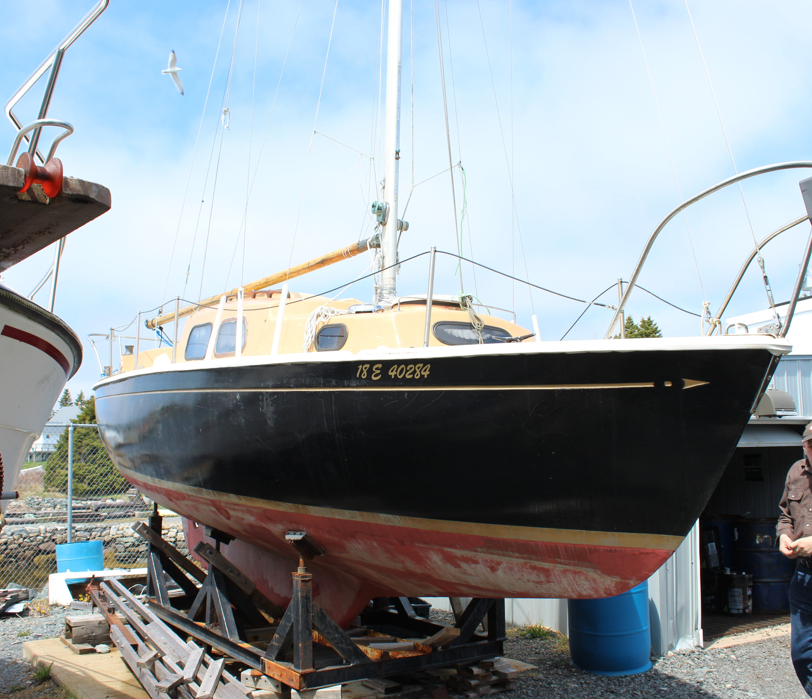

Documentation for my boat, the "Shenanigans". Only tracking stuff I've had to actually deal with myself.
As such it's always going to be pretty incomplete.

#Table of Contents

 * [Table of contents](#table-of-contents)
 * [Photos](#photos)
 * [Sailboat Data](#sailboat-data)

#Photos

#Sailboat Data

Please see [sailboatdata.com](http://sailboatdata.com/viewrecord.asp?class_id=2925) entry for 'New Horizons 26'.

#Onboard Computer

The primary computer is an odroid-xu4. This is responsible for the following.

 * Caching web content
 * Storing files
 * Charting
 * Acting as a thin-client for chart data
 * Logging position data
 * Running software defined radio
  * Downloading weather faxes
  * AIS receiver (boat posistion tracking
 * Wifi rebroadcasting/antenna management
 * Power level logging 
 * Water level logging

##IO

In order to keep power usage low we use an SSD with bcache.

|Device|Gbit/s|Notes|
|------|------|-----|
|USB3  |5     |     |
|USB2  |0.4   |     |
|SSD   |6     |     |
|HDD   |0.8   |     |

As you can see, our only real concern is that SSD, so it gets a usb port all to its own.

