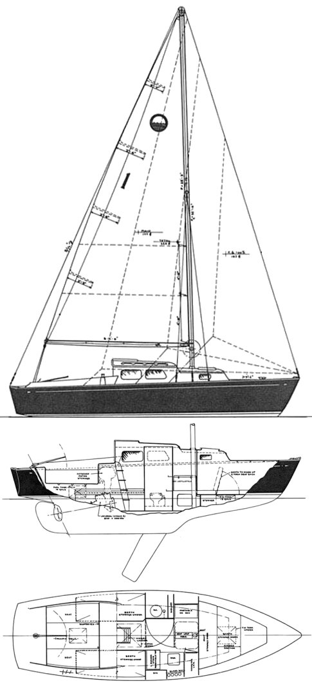

Documentation for my boat, the "Shenanagins". Only tracking stuff I've had to actually deal with myself.
As such it's always going to be pretty incomplete.

#Table of Contents

 * [Table of contents](#table-of-contents)
 * [Sailboat Data](#sailboat-data)

#Sailboat Data

|||||
---|---|---|---  
**Hull Type:** |  Keel/Cbrd. | **Rig Type:** |  Masthead Sloop  
**LOA:** |  25.42' / 7.75m | **LWL:** |  21.25' / 6.48m  
**Beam:** |  7.75' / 2.36m | **Listed SA:** |  333 ft2 / 30.94 m2  
**Draft (max.)** |  6.42' / 1.96m | **Draft (min.)** |  3.00' / 0.91m  
**Displacement:** |  6030 lbs./ 2735 kgs. | **Ballast:** |  1600 lbs. / 726 kgs.  
**Sail Area/Disp.1:** |  16.13 | **Bal./Disp.:** |  26.54% | **Disp./Len.:** |   280.54  
**Designer:** |  Sparkman & Stephens  
**Builder:** |  Ray Green & Co.(USA)  
**Construction:** |  FG | **Bal. type:** |    
**First Built:** |  1958 | **Last Built:** |   | **# Built:** |  175  

**AUXILIARY POWER (orig. equip.)**  

|||||
---|---|---|---  
**Make:** |  Universal | **Model:** |  Atomic 4  
**Type:** |  Gas | **HP:** |  25  

**TANKS**  

|||||
---|---|---|---  
**Water:** |  15 gals. / 57 ltrs. | **Fuel:** |  15 gals. / 57 ltrs.  
  
**RIG AND SAIL PARTICULARS**  [**KEY**](http://sailboatdata.com/rig_diagram.htm "Rig and Sail Key Diagram" )  

|||||
---|---|---|---  
**I(IG):** |  32.30' / 9.85m | **J:** |  9.80' / 2.99m  
**P:** |  28.80' / 8.78m | **E:** |  12.10' / 3.69m  
**PY:** |   | **EY:** |    
**ISP:** |   | **SPL/TPS:** |    
**SA(Fore.):** |  158.27 ft2 / 14.70 m2 | **SA(Main):** |   174.24 ft2 / 16.19 m2  
**Sail Area (100% fore+main triangles):** |   332.51 ft2 / 30.89 m2  
**Sail Area/Disp.2:** |  16.11 | ** Est. Forestay Length.: 33.75' / 10.29m  
**BUILDERS (past & present)**  
**More about & boats built by:**  |  [Ray Greene & Co.](http://sailboatdata.com/view_builder.asp?builder_id=99)  
**DESIGNER**  
**More about & boats designed by:**  |  [ Sparkman & Stephens](http://sailboatdata.com/view_designer.asp?designer_id=12)  

**NOTES**  
S&amp;S; design #1235.  
Originally promoted as the NEW HORIZONS 25.  
This was S&amp;S;'s first production sailboat designed as an ALL fiberglass
small cruiser.  
Ray Green, a pioneer in the field, as the builder, made a perfect fit.  
Many of the components for the interior, etc, were molded fiberglass, a
practice that did not become common for a number of years to come.

Data taken from [sailboatdata.com](http://sailboatdata.com/viewrecord.asp?class_id=2925)
